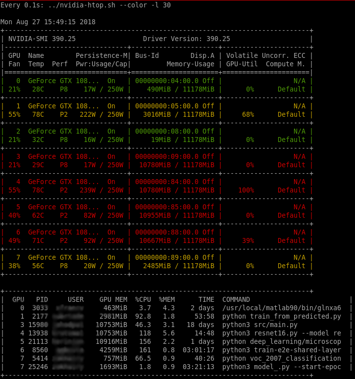

# nvidia-htop

A tool for enriching the output of `nvidia-smi`.

# Install
`pip3 install nvidia-htop`

**Yes, this tool has been on PyPi since 2021! Enjoy the super-easy way to install it.**

## Usage

    nvidia-htop.py [-l [length]]
      print GPU utilization with usernames and CPU stats for each GPU-utilizing process

      -l|--command-length [length]     Print longer part of the commandline. If `length'
                                       is provided, use it as the commandline length,
                                       otherwise print first 100 characters.
      -c|--color                       Colorize the output (green - free GPU, yellow -
                                       moderately used GPU, red - fully used GPU)

Note: for backward compatibility, `nvidia-smi | nvidia-htop.py [-l [length]]` is also supported.

Note: running inside a container (docker, singularity, ...), `nvidia-smi` can only see processes running in the container.

## Example output

    $ nvidia-htop.py -l
    Mon May 21 15:06:35 2018
    +-----------------------------------------------------------------------------+
    | NVIDIA-SMI 390.25                 Driver Version: 390.25                    |
    |-------------------------------+----------------------+----------------------+
    | GPU  Name        Persistence-M| Bus-Id        Disp.A | Volatile Uncorr. ECC |
    | Fan  Temp  Perf  Pwr:Usage/Cap|         Memory-Usage | GPU-Util  Compute M. |
    |===============================+======================+======================|
    |   0  GeForce GTX 108...  Off  | 00000000:04:00.0 Off |                  N/A |
    | 53%   75C    P2   174W / 250W |  10807MiB / 11178MiB |     97%      Default |
    +-------------------------------+----------------------+----------------------+
    |   1  GeForce GTX 108...  Off  | 00000000:05:00.0 Off |                  N/A |
    | 66%   82C    P2   220W / 250W |  10783MiB / 11178MiB |    100%      Default |
    +-------------------------------+----------------------+----------------------+
    |   2  GeForce GTX 108...  Off  | 00000000:08:00.0 Off |                  N/A |
    | 45%   67C    P2    85W / 250W |  10793MiB / 11178MiB |     51%      Default |
    +-------------------------------+----------------------+----------------------+

    +-----------------------------------------------------------------------------+
    |  GPU   PID     USER    GPU MEM  %MEM  %CPU  COMMAND                                                                                               |
    |    0  1032 anonymou   10781MiB   308   3.7  python train_image_classifier.py --train_dir=/mnt/xxxxxxxx/xxxxxxxx/xxxxxxxx/xxxxxxx/xxxxxxxxxxxxxxx  |
    |    1 11021 cannotte   10765MiB   114   1.5  python3 ./train.py --flagfile /xxxxxxxx/xxxxxxxx/xxxxxxxx/xxxxxxxxx/xx/xxxxxxxxxxxxxxx                |
    |    2 25544 nevermin   10775MiB   108   2.0  python -m xxxxxxxxxxxxxxxxxxxxxxxxxxxxx                                                               |
    +-----------------------------------------------------------------------------+

## Screenshot with output coloring

